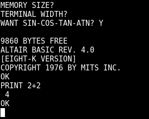

<p align="center">
  
</p>
<h1 align="center">lib8080</h1>
<p align="center">
  <a href="https://travis-ci.org/GunshipPenguin/lib8080">
    
  </a>
</p>

An accurate, well tested emulation library for the Intel 8080 written in C99.

## Usage

lib8080 consists of
[just 2 files](https://github.com/GunshipPenguin/lib8080/tree/master/src). To use
it in your project, just include i8080.h, compile and run.

See [api.md](https://github.com/GunshipPenguin/lib8080/blob/master/api.md) for
an overview of the API.

## Tests

lib8080 is heavily tested using
[AttoUnit](https://github.com/GunshipPenguin/attounit). Unit tests are located
in `test/unit`. Every CPU instruction is tested at least once, with many having
multiple tests to verify correct behaviour with regard to status flags / edge
cases, etc.

lib8080 uses CMake as its build system. To run the unit tests, first build
the test binary and run it as follows:

```
cmake .
make lib8080test -j2
./lib8080test
```

This repository also contains four CP/M test binaries that verify the
functionality of the 8080 pretty comprehensively. They are:

- CPUTEST.COM by Supersoft Associates
- TEST.COM by Microcosm Associates
- 8080PRE.COM by Frank D. Cringle and Ian Bartholomew
- 8080EXM.COM by Frank D. Cringle and Ian Bartholomew

Notably, the last one (8080EXM.COM) is the "8080 CPU Exerciser", which takes
more than 3 hours to run on a regularly clocked 2 MHz 8080 and tests essentially
everything that can be tested on an 8080.

These binaries are located in `test/integration/test_bins`, and files containing
their expected output are located in `test/integration/test_bins/output`.

They can be easily run using the cpmloader program (built with make target of
the same name). cpmloader emulates a very minimal CP/M system only supporting
BDOS functions 2 and 9 (output character and output string).

As an example, to use cpmloader to run TEST.COM from the top level directory,
use:

```
./cpmloader test/integration/test_bins/TEST.COM
```

The `integrationtest.sh` script automatically runs all test binaries using
cpmloader.

## License

[MIT](https://github.com/GunshipPenguin/lib8080/blob/master/LICENSE) © Rhys Rustad-Elliott

[CP/M binaries used for
testing](https://github.com/GunshipPenguin/lib8080/tree/master/test/integration/test_bins)
are copyright their respective owners:
- CPUTEST.COM © 1981 Supersoft Associates
- TEST.COM © 1980 Microcosm Associates
- 8080PRE.COM (GPLv3) © 1994 Frank D. Cringle © 2009 Ian Bartholomew
- 8080EXM.COM (GPLv3) © 1994 Frank D. Cringle © 2009 Ian Bartholomew
